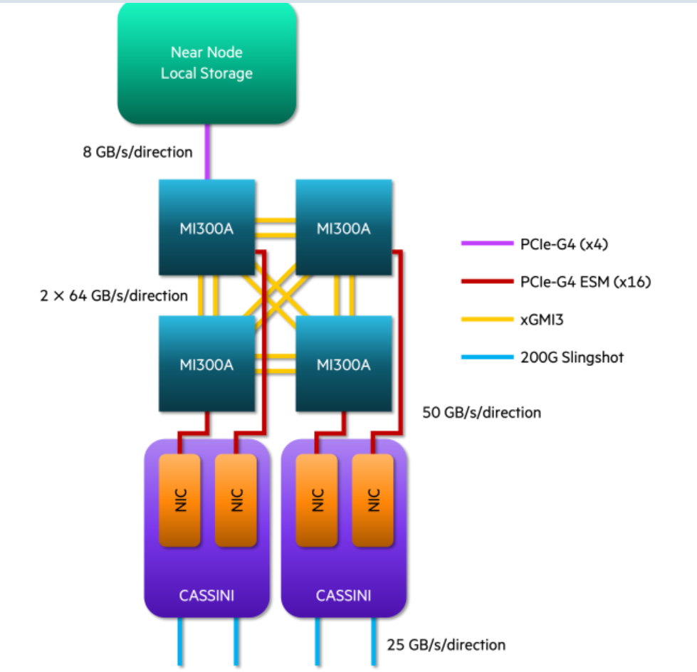

1. Research what the term “performance” could mean for an HPDA application. Note that there is not a
single performance characteristic but multiple characteristics that are meaningful. Document why a use
case is high-performance. Your notes should cover about 1/4-page.

performance might mean: 
- Speed of handling data
- Robustness to errors/server downs etc. 
- How much data can the system handle
- How well it can handle data variety
- Some form of "accuracy" measurement i.e. how well does it do the job it has to do with some sort of gold standad depending on the task

> source: (https://hpi.de/fileadmin/user_upload/fachgebiete/rabl/publications/2021/A_Survey_of_Big_Data_High_Performance_Computing_and_Machine_Learning_Benchmarks.pdf)[Hasso Plattner Institut: A Survey of Big Data, High Performance
Computing, and Machine Learning Benchmarks]

From literature: 
- resource consumption (CPU, memory, I/O)
- running time (speed)
- throughput 
- "Scaleup" how well does the system behave when you scale up the servers (this is an interesting one, but really useful)
- Levels of parallelism 

2. Alternatives for "supercomputer architecture" 
> source: https://top500.org

There are three El Capitan systems that have the same architecture
- Compute Nodes with 4 AMD MI300A each (this is a combined CPU/GPU) 
-> Interesting to me that they combine CPU/GPU on systems I know they have this seperated, but this seems to make things easier when you don't have to shuffle your data around all the time. 
- each of these Nodes has its own socket with its own memory
-> Fast access to own 128GB of memory without having to go over the connections to the other memory places. 
-> If one socket breaks you can just replace it, no need to replace/fix the entire system
-> The general system seems pretty modular

Tutorial:
software, harddisk SDD, how are the storage systems connected (this last one hanged a lot in the past, made like 100x faster)
interconnect speed, network speed, only application running at a time seems good